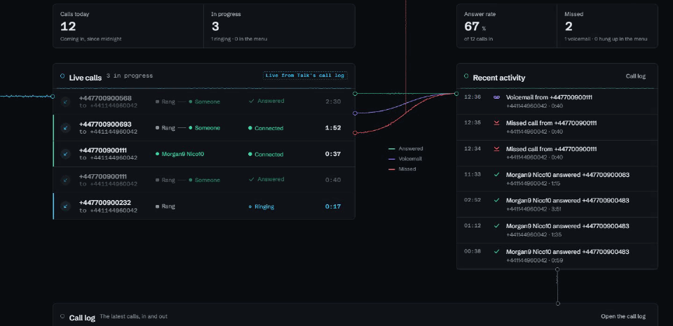
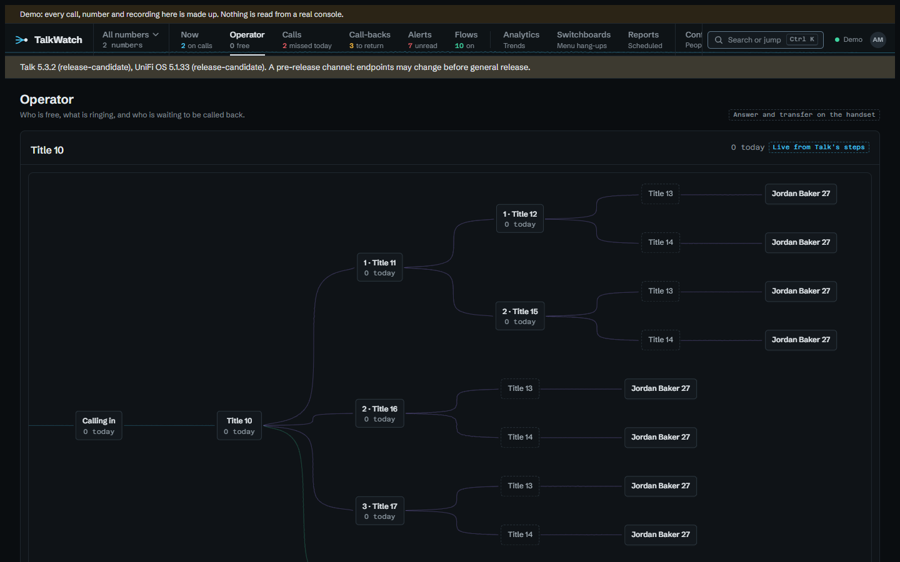
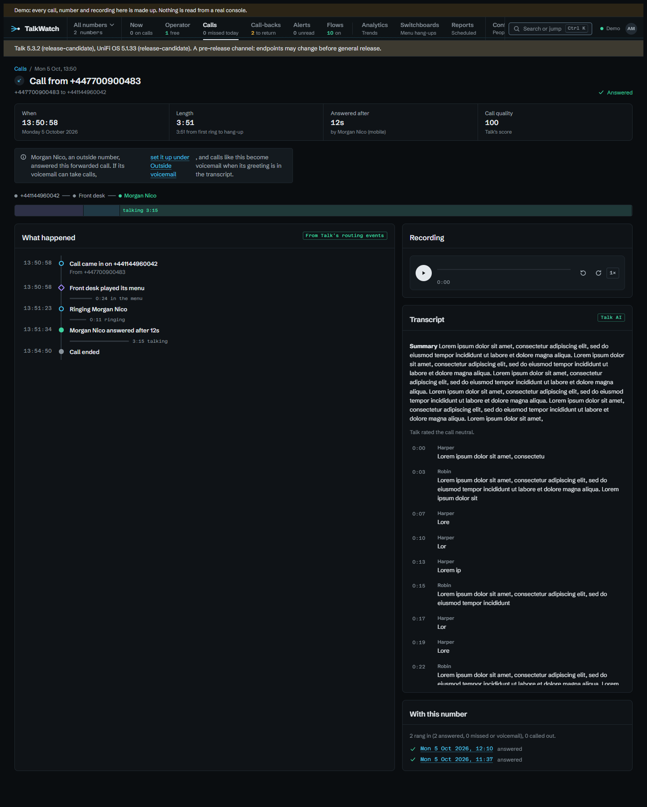
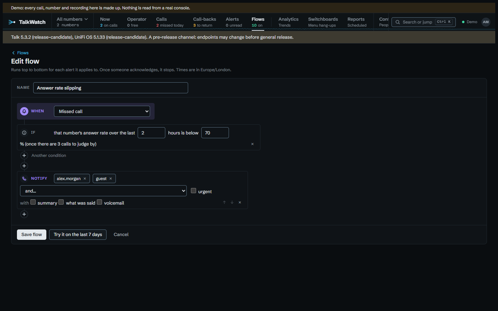
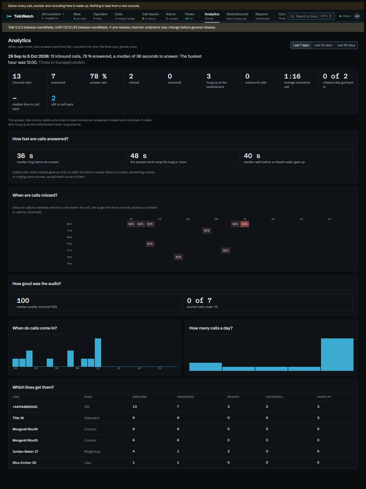
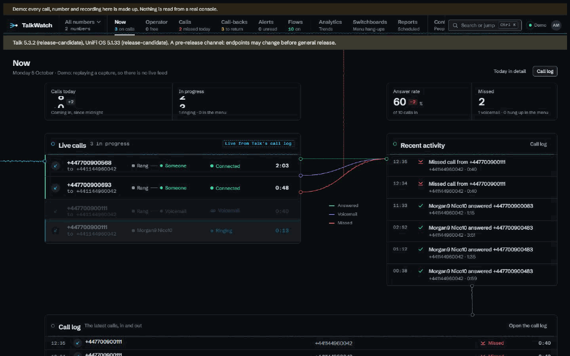

# TalkWatch

A self-hosted dashboard and alert router for UniFi Talk.



TalkWatch copies your call history, voicemail and recordings off a UniFi Talk
console (UDM Pro or UDM SE) into its own database, works out what actually
happened to each call, shows what the phones are doing right now, and tells the
right people about missed calls, new voicemail and handsets dropping off. Each
person sees only the lines they've been given. It's one container and a
PostgreSQL database, built for a small site: tens of extensions and a few
thousand calls a day.

**[Documentation](https://thecodesaiyan.github.io/talkwatch/)** ·
**[Try the demo](https://thecodesaiyan.github.io/talkwatch/demo/)** ·
**[Install](https://thecodesaiyan.github.io/talkwatch/install/)** ·
**[Releases](https://github.com/TheCodeSaiyan/talkwatch/releases)**

## Why it exists

Talk marks nearly every inbound call `accepted`. On the console TalkWatch was
built against, that was 151 of 155 inbound calls, whether someone answered, it
went to voicemail or the caller hung up at the switchboard; the other four were
spam Talk blocked. So Talk's own log can't tell you how many calls you missed.
TalkWatch reads each call's events instead and works out what happened, and
everything below is built on that.

## What it looks like

**Now** is laid out as calls move through the system. They stream in to Live
calls, leave by how they ended for Recent activity, and drop into the call log.
A missed call's mark climbs to the rail, and "missed today" changes when it
lands. Choose any call and it opens beside the page, so the board stays where
it is.

| | |
|---|---|
|  |  |
| **Operator**, for whoever looks after the phones: what needs someone, who's free by ring group, and who's waiting to be called back. | **A call** told as what happened: the route it took, how long each step lasted, its recording and Talk's transcript. |
|  |  |
| **Alert flows**: a trigger, conditions, then steps (notify, wait, branch, assign, bundle) by ntfy, email, Telegram, webhook or in TalkWatch. Tried against the last week's calls before they're switched on. | **Analytics**: answer rate, busiest hours, how long phones ring, when calls go unanswered, how fast missed callers were got back to. |



Also: a call-back list that clears itself when anyone rings the caller back,
switchboard figures (how many callers hang up during each greeting),
scheduled reports built with each reader's own access, outside phones and
their voicemail, a number switcher, retention with a legal hold, CSV and
Parquet export, a read-only API, OIDC sign-in and two-factor.

## Trying it

The image carries a demo that replays a capture from a real console, so you
can look round with no console at all. Every number in it is fictional and
every recording synthetic.

```yaml
services:
  db:
    image: postgres:17-alpine
    environment: { POSTGRES_DB: talkwatch, POSTGRES_USER: talkwatch, POSTGRES_PASSWORD: change-me }
  talkwatch:
    image: ghcr.io/thecodesaiyan/talkwatch:latest
    depends_on: [db]
    ports: ["8080:8080"]
    environment:
      ConnectionStrings__TalkWatch: Host=db;Database=talkwatch;Username=talkwatch;Password=change-me
      Demo__Enabled: "true"
      Bootstrap__AdminUsername: admin
      Bootstrap__AdminPassword: a-long-password-of-your-own
```

Then open `http://<host>:8080` and choose **Sign in as guest**. For your own
console, follow [Installing](https://thecodesaiyan.github.io/talkwatch/install/).

## Deploying on Railway

The template deploys the published image, PostgreSQL and a volume for
recordings into your own Railway account. TalkWatch reaches the site's console
through the site gateway's own WireGuard VPN, or Tailscale, set up on its
Console page.
[Deploying on Railway](https://thecodesaiyan.github.io/talkwatch/railway/) says
what to fill in.

[](https://thecodesaiyan.github.io/talkwatch/railway/)

## Limits, plainly

- **It reads Talk's undocumented local API.** When a response stops looking as
  expected, TalkWatch stops writing rather than store something wrong, and says
  so on every page. The console keeps its log, so nothing is lost while a fix
  is on its way.
- **It's been run against one console**: UniFi OS 5.1.33, Talk 5.3.2. Other
  versions may well work; reports either way are welcome.
- **It only reads.** Answering, holding and transferring stay on the handset.
- Ring groups aren't yet recognised from a call that only rang the members,
  trunk status isn't shown, SMS isn't copied (Talk offers it only in the US),
  and it's one site per install.

## Not affiliated with Ubiquiti

TalkWatch is an independent project. It is not made, endorsed or supported by
Ubiquiti Inc. UniFi and UniFi Talk are Ubiquiti's trademarks, used here only to
say what TalkWatch works with.

## Developing

You need the .NET 10 SDK and Docker. `dotnet build` and `dotnet test`, then
`git config core.hooksPath .githooks` once per clone for the fixture guard.
[Building and testing](https://thecodesaiyan.github.io/talkwatch/developing/)
covers the fixtures, CI and releases, and [CONTRIBUTING.md](CONTRIBUTING.md)
what makes a change easy to take.

## Licence

MIT. See [LICENSE](LICENSE).
