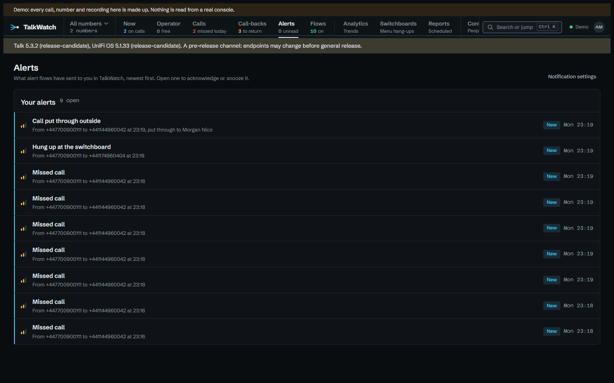
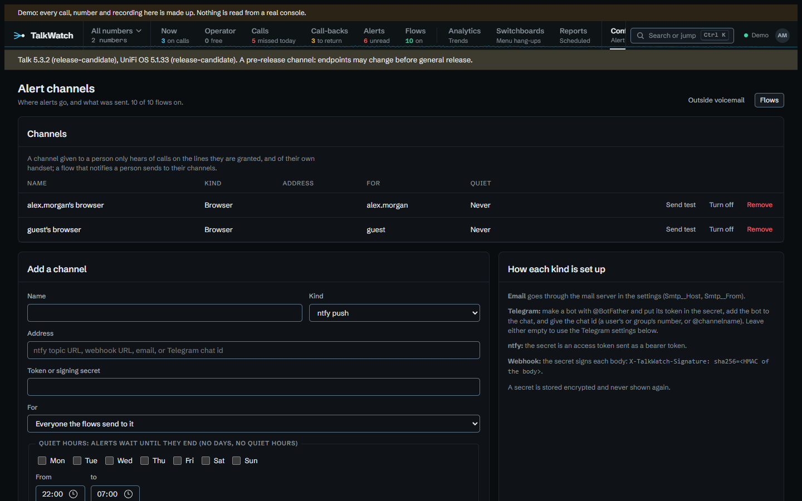
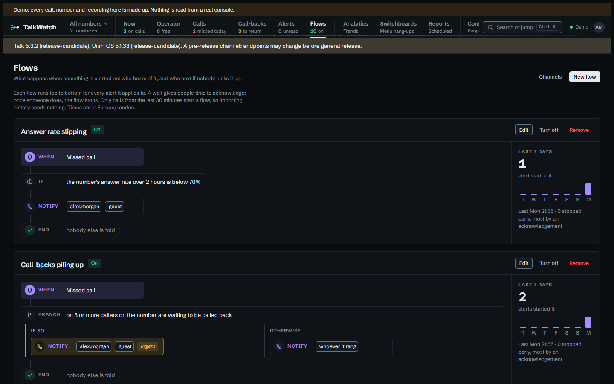
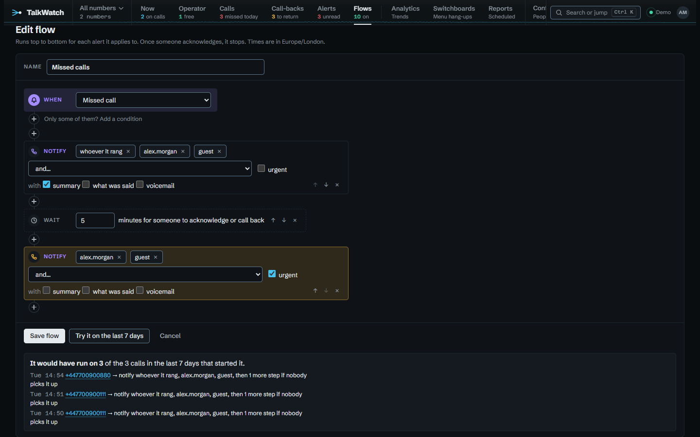

# Alerts

Channels say where alerts go, and are set up under **Configure → Alert channels**. Flows say what happens when something is alerted on: who hears of it first, and who next if nobody picks it up; they have their own **Flows** workspace in the rail. The **Alerts** workspace is your inbox: what flows have sent to you in TalkWatch, newest first. Admins set up anything; anyone else whose role lets them set up their own alerts sets up their own, as a later section explains.



## What can raise an alert

| Event | When |
|---|---|
| Any incoming call | An inbound call starts. With a time window, this is the after-hours alert. |
| Missed call | An inbound call rang a phone or reached voicemail, and ended with nobody answering and no message left. |
| New voicemail | A caller left a message. |
| Voicemail transcribed | Talk's transcript of a voicemail has arrived, usually a little after the voicemail itself. Once per voicemail. The alert names the call, never what was said; it's there so a flow can test the words (see [Conditions](#conditions)). |
| Hung up at the switchboard | An inbound call ended before ringing anyone: during the greeting or the menu. |
| Handset offline | A handset that was online reports anything else. |
| TalkWatch stopped copying calls | The console's responses changed shape; raised once, when it starts. |
| Call rated negative | Talk's transcription rated a call from the last day negative. Names the call, never what was said. |
| Poor call quality | Talk scored a call under 70 of 100 for quality. |
| Handset can't take calls | A handset still online lost its registration, so it can neither make nor take calls. |
| Handset update available | Talk has a firmware update waiting for a handset. |
| Talk account problem | The account stops being active, calling is suspended, a payment fails, or the account is blocked, reports unauthorised use or goes into emergency mode. Once when each problem appears. |
| Recording or transcription switched off | Call recording or AI transcription goes from on to off in Talk. Off when TalkWatch first looks raises nothing, since it may be off on purpose. |

Missed calls and switchboard hang-ups are kept apart because most switchboard hang-ups aren't missed calls. On the console TalkWatch was built against, 70 of 155 inbound calls ended at the switchboard, averaging about 14 seconds: people hanging up during the greeting, and robocalls. Add a flow for them only if you want to hear about those.

Only calls from the last 30 minutes raise alerts, so importing a history, or catching up after an outage, doesn't send a flood. A call that's still ringing raises only **Any incoming call**; missed, voicemail and switchboard hang-up wait until it has ended.

The Talk account and settings are checked hourly, and what was last seen is kept, so a restart neither misses a change nor raises one twice. Alerts about the whole site (TalkWatch itself, the account, the settings) are on no line, so only admins can build flows on them. There is no alert for running low on included minutes or transcriptions yet: Talk reports usage, but no capture so far shows what its numbers count.

### Calls an outside answering line's voicemail took

When a switchboard or a person's forward sends a call to an outside contact, such as an assistant or an answering service, Talk logs it as answered the moment anything picks up, the provider's voicemail included. So without help these calls never raise **Missed call** or **New voicemail**, and they count as answered in every figure.

Tick the contact under **Configure → Outside voicemail** (for those who may manage alerts), with phrases from its greeting ("is not available", "leave a message after the tone"). Phrases match whatever the case, and the letter *o* and the digit *0* count as one, because speech-to-text writes a brand however it hears it: "o2 messaging" matches a transcript's "02 messaging". Each call it answers is then read against them once Talk's transcript arrives:

- No phrase matches: a person answered, and the call stays answered.
- A phrase matches and the caller says a few words after it: they left a message there. The call becomes **Voicemail, outside**, and raises **New voicemail** and then **Voicemail transcribed**.
- A phrase matches and nothing follows: they hung up at the greeting. The call becomes **Missed, outside**, and raises **Missed call**.

Both new outcomes count as voicemail and missed everywhere: the call-back list, the Calls page filters, the figures and reports. The alerts arrive as late as the transcript does, once, and only for calls from the last day; whatever was sent when the call ended, **Any incoming call** for instance, is not taken back.

A call with no transcript is left answered, and its page says it wasn't checked: transcription is on for some numbers and not others, and guessing from the length would mislabel short calls a person really took. The call's page says what was decided and why, the phrase that matched, and anyone who may mark call-backs on it can correct it: a correction stands over the transcript from then on. A phrase saved later applies to calls from then on; **Reprocess its calls** reads every call the contact has answered again, against the phrases as they are now, so a new phrase can make past calls voicemail and one taken away can make them answered again. Calls corrected by hand are left alone, and only calls from the last day raise alerts. A forwarded call an outside number answered, where that number isn't set up yet, says so on its page and links straight to its settings, for those who may set it up. The Outside voicemail page counts, for each contact over the last 30 days, the calls it answered, how many went to its voicemail, and how many weren't checked for want of a transcript.

### Calls put through to an outside phone

A ring group with a mobile in it, a switchboard option that forwards to one, or a group that overflows to one: Talk sends the call to an outside contact, and whoever carries that phone has a few seconds to decide whether to answer a number they may not know. TalkWatch can tell them who is calling while it rings.

Say who carries each phone under **Configure → Outside phones** (for those who may manage people), or under **Carries the outside phone of** on a person's own page. One phone can be carried by several people, as an on-call mobile passed round the staff is. Then build a flow that starts on **Any incoming call**, with the condition **If put through outside**, and notifies **Whoever it was put through to outside**.

- Talk's live feed reports the outside phone being tried while the call is still going, so the alert goes then rather than when the call is over. A flow with that condition starts when the call is put through, not when it comes in, so it waits for the forward instead of missing it. Every other **Any incoming call** flow starts when the call comes in, as before, so none of them runs twice for one call.
- If TalkWatch only hears of the call once it has ended, because the live feed was down and the poll caught it, the alert still goes, ending *The call has ended*. The person still learns who rang them.
- It never goes by email, which would arrive long after the phone stopped. Push, ntfy, Telegram and webhooks only, and never bundled.
- Once someone else answers, a desk phone or another mobile, the alert is acknowledged and whoever was told hears that someone else answered, so nobody rings the caller back for nothing. Those who carry the phone that answered aren't told, since it was theirs. A phone ticked under **Outside voicemail** doesn't count as answering, because its voicemail answers too and that's only known once the transcript is read.
- **Everyone who carries an outside phone, whatever the call** is there too, for a team that wants every forwarded call shown on every on-call phone.

The step reaches people who may not see the line the call came in on, which nothing else in a flow does. They hear the caller's number and name, the number rung and when, and nothing more: no summary, transcript or voicemail whatever the step asks for, and no link to the call or to the alert, since neither would open for them. Someone who may see the line gets the alert as anyone would. Naming these people is for admins only.

!!! note "Handset offline"
    Only `online` has been seen from a console so far, so any other status counts as offline. That may include a
    handset restarting for a firmware update.

## Channels



- **ntfy** — a push to a topic URL, with an optional access token. The title names the caller; the body then gives their number and the line they rang, when and for how long, and the flow that sent it, each on its own line. It's plain text, because the ntfy phone app shows Markdown as typed. Notifications carry up to three buttons: **Acknowledge**, which posts straight from the phone; **Call back**, which opens the dialler on the caller's number; and **Open**, the alert's page, to snooze it or see more. Tapping the notification itself opens the call, for anyone who may see it.
- **Email** — through the mail server set on the **Alert channels** page, or with `Smtp__` settings. **Send test email**, under the settings, checks them at once and shows what the server said. Leave the username empty for a server that takes mail without signing in. With a username set, a server that offers no sign-in fails the send and says so (*offers no sign-in on an unencrypted connection: turn STARTTLS on, or clear the username if it needs none*), rather than sending without the sign-in you asked for. Most servers offer sign-in only once the connection is encrypted, which is why STARTTLS is the usual fix.
- **Telegram** — through a bot, to a chat, group or channel. The bot token and chat id can be on the channel, on the alerts page, or in `Telegram__` settings; the most specific wins.
- **In TalkWatch** — the **Alerts** workspace in the rail, with an *N unread* count, a pop-up on any TalkWatch page open when it arrives, and desktop notifications in each browser someone allows, even with TalkWatch closed. It's always one person's: anyone turns it on from their **Account** page (or an admin adds it for them), and **Allow desktop notifications** there registers the browser they're using. Desktop notifications are Web Push, signed with a key pair TalkWatch makes the first time and keeps, and need TalkWatch served over HTTPS, since browsers allow push only there; a browser that stops taking them is forgotten. A flow reaches it by notifying the person.
- **Webhook** — a JSON POST to any address. With a signing secret, each body is signed: `X-TalkWatch-Signature: sha256=<HMAC-SHA256 of the body>`, so the receiver can check the alert came from TalkWatch. `X-TalkWatch-Event` says what it is (the alert's type, `Acknowledged` for the follow-up, or `Bundle`), and `X-TalkWatch-Delivery` is the delivery's id, the same on every retry, so a receiver can drop repeats.

```json
{
  "id": "…", "type": "MissedCall", "at": "2026-10-04T09:12:31+01:00",
  "title": "…", "message": "…",
  "escalation": false, "acknowledged": null, "stage": 0, "urgent": false,
  "call": { "uuid": "…", "time": "…", "direction": "in", "status": "…", "from": "+44…", "to": "+44…" },
  "userUuid": null,
  "links": { "page": "…", "acknowledge": "…/ack", "snooze": "…/snooze?minutes=60" },
  "summary": null, "transcript": null, "voicemail": null
}
```

`acknowledged` holds `at` and `by` once someone has. `summary`, `transcript` and `voicemail` (a link to the call's page) are filled only when the notify step asks for them. Word of a call put through to an outside phone leaves `call.uuid` and `call.status` empty and has no `links`, since the person behind it may not be allowed the call. A bundle is one POST with `type: "Bundle"`, a `title`, and an `alerts` array of the same objects.

Secrets are stored encrypted and never shown again. Each channel has a **Send test** button. A channel TalkWatch won't take says *Not added* and why, above the form, and keeps what you typed.

A channel can be given to one person. It then hears only of calls on that person's lines and of their own handset, whatever a flow says, so a flow can't be used to show someone calls they couldn't see. The one exception is a call put through to an outside phone that person carries: they hear who is calling, and only that (see [Calls put through to an outside phone](#calls-put-through-to-an-outside-phone)).

## Flows

A flow starts on one kind of alert, checks its conditions, then runs its steps top to bottom. The **Flows** workspace draws each one as the diagram it runs, with how often it fired each day of the last week and when it last did. **New flow** builds one; a **+** on the line puts a step or condition anywhere in it.




- **When** — the kind of alert it starts on.
- **If** — conditions that must all hold, or the flow doesn't start. They're listed [below](#conditions).
- **Notify** — people, channels, or both, and a few kinds of recipient worked out from the call (see [Who a notify step reaches](#who-a-notify-step-reaches)). A person is reached on their own channels, and only about what they may see, so naming someone never shows them a call outside their lines. Marked **urgent**, it goes at high priority where the channel has one (ntfy's `high`). It can also send Talk's **summary**, **what was said** and the **voicemail** with the alert, as [a later section](#sending-the-summary-what-was-said-and-the-voicemail) explains.
- **Wait** — gives people that long to acknowledge, or on a call alert to acknowledge or call back. If someone does, the flow stops there; if nobody does, it carries on, and later notifications say it's still not been picked up.
- **Assign** — puts the call on one person's call-backs, shown as *Assigned to* on the **Call-backs** page. The step tells nobody by itself, so pair it with a Notify. Call alerts only. An admin can name anyone; anyone else can name only themselves.
- **Bundle** — from here on, what the flow sends to each channel is gathered for up to 240 minutes and sent as one message (*3 × Missed call*) rather than one per alert. Alerts acknowledged in the meantime are left out. It's for a busy line, where a phone that buzzes at every missed call ends up ignored.
- **Branch** — on any condition: one path of steps if it holds, another if it doesn't. Branches go three deep at most.

**Try it on the last 7 days**, in the editor, runs the flow against the past week's calls without sending anything: how many would have started it, and what its first step would have done. It looks only at calls you can see, and at the latest 500.



### Conditions

| Condition | Holds when |
|---|---|
| a line | the call touched any of the lines chosen |
| who it rang | it rang one of the people or ring groups chosen |
| a time | days and times in the site's time zone, inside or outside. An overnight window such as 22:00 to 06:00 works, and follows the clocks changing |
| callers | only these, or everyone except these. Numbers in any format, international prefixes such as `+44800*`, and `withheld` for a caller whose number didn't come through |
| repeat caller | the caller has rung at least N times (up to 20) in the last so many minutes, this call included |
| caller unanswered | the caller has gone unanswered (missed or voicemail) N times in the last so many hours, up to a week |
| number unanswered | N calls in on the same number went unanswered in the last so many minutes, up to a day |
| callers waiting | at least N missed callers on the number are still to be called back, as the Call-backs page counts them |
| answer rate | the number's answer rate over the last so many hours, up to a day, is below a percentage. Only once there are three calls to judge by, so one missed call isn't a rate of nothing |
| how long it rang | longer than so many seconds before it was answered, went to voicemail or the caller hung up |
| known caller | the caller is, or isn't, someone known: named on the call, or a contact with their number |
| where they rang from | from abroad, or from the site's own country. A withheld caller is neither |
| put through outside | Talk put the call through to an outside contact, or didn't (see [Calls put through to an outside phone](#calls-put-through-to-an-outside-phone)) |
| call quality | Talk scored it below so many out of 100. A call it didn't score is below nothing |
| menu option | the caller chose any of these switchboard options |
| what it says | the voicemail's transcript has any of these words or phrases: whole words, any case. **Voicemail transcribed** flows only, and admins only |

A withheld caller can't be counted, so the conditions about a caller's history never hold for one. The editor warns that a flow testing what a voicemail says tells whoever it notifies that those words were said, even though the alert itself never quotes the voicemail.

### Who a notify step reaches

- **A person**, on their own channels, about what they may see.
- **A channel**.
- **Whoever is free in** a ring group: its members not on a call when the step runs. When nobody is free, it's every member, so the step still reaches someone.
- **Whoever it rang**: the person whose line it was, or the members of the group it rang.
- **A contact**, at the email Talk holds for them. A contact with only a mobile is listed but can't be chosen, since texts aren't set up yet. The address is kept in step with Talk, so a changed one is used from the next alert.
- **Whoever it was put through to outside**, and **everyone who carries an outside phone**, covered under [Calls put through to an outside phone](#calls-put-through-to-an-outside-phone).

Whoever is free, whoever it rang, contacts and the outside-phone recipients are for admins only, since they reach people the flow's author didn't pick by name. The first two work from each person's **On the phone system** link on their page, which ties them to their Talk user; a group none of whose members is linked says *(nobody linked yet)*.

### Sending the summary, what was said and the voicemail

A notify step can send any of Talk's summary of the call, what was said, and the voicemail. Each goes to a channel only when its owner could read or hear it in TalkWatch themselves, and only once it exists, so ask for what was said on a **Voicemail transcribed** flow rather than **New voicemail**, which runs before Talk has written it.

- **Email** carries the text in full, and the voicemail attached up to 10 MB; a longer one is a link to play it.
- **ntfy** and **Telegram** carry the text, trimmed to fit, and a link to play the voicemail.
- **In TalkWatch** adds the summary to the desktop notification.
- **Webhooks** get `summary`, `transcript` and `voicemail` fields.

### An example

For example, missed calls on the sales line:

```text
When    Missed call
If      on Sales
        not from withheld
Branch  on Mon–Fri 09:00–17:30
  If so       Notify  Sales team (ntfy)
              Wait    10 minutes
              Notify  Nigel
  Otherwise   Notify  On call (Telegram)
              Wait    15 minutes
              Notify  Nigel, urgent
```

A branch is decided by the alert itself, when it happens, so what the page shows is exactly who hears of what. The path is fixed then too: changing a flow changes what later alerts do, not one already under way. Turning a flow off stops the alerts it has started at their next step.

A person with no channel turned on is marked **(no channel yet)** wherever a flow names them, since they'd hear nothing.

Getting back to a missed caller acknowledges their alerts: ringing them back from any phone on the system, a later call from them being answered, or marking them done on the **Call-backs** page. So a flow such as *Missed call → notify the desk → wait 60 minutes → notify the manager* already means *tell the manager if nobody has called them back within the hour*, and it stops by itself once someone has.

Upgrading from a version with rules turns each rule into a flow that does the same: its line, window and callers become conditions; it notifies its channels; and with escalation it waits, then notifies the escalation channels as urgent. An escalation already counting down carries on.

## Delivery

Deliveries go into an outbox and are retried after 1, 5 and 15 minutes, then 1 hour, then every 6 hours, and given up after 8 tries. A channel that's down delays only its own alerts. A channel can have **quiet hours**: alerts due inside them wait until they end, and are dropped if someone acknowledges them meanwhile. Word of a call put through to an outside phone is dropped instead of held, since by morning the call is long over; the delivery says so in the alert's history. Marked **urgent**, it goes through quiet hours.

## Your own alerts

Anyone whose role lets them *set up their own alerts*, site-wide (a Manager's does) or on a number, gets the **Flows** workspace and **Alert channels**. They see and change only their own channels and flows, and only the alerts that reached their channels. Every channel they add is theirs, so it hears only of calls on their lines and of their own handset, whatever a flow says. Their flows can notify only themselves and their own channels, name only lines they hold, and can't use the alerts about the whole site. The mail server and Telegram settings are for admins.

## Acknowledge and snooze

Each alert carries a link to a page, valid for seven days, that acknowledges it or snoozes it for an hour or four. Acknowledging stops anything still waiting to be sent and the rest of the flow; snoozing holds the flow's next step off until the snooze ends. Every channel the alert reached then gets a quiet follow-up, **Acknowledged: …**, saying who acknowledged it and when, so whoever pressed the button sees it worked and everyone else knows it's in hand. On ntfy it comes at low priority, with no buttons. A follow-up due in a channel's quiet hours is dropped rather than held until morning, by when it would be stale. A link in a notification doesn't say whose phone it was on, so those read as acknowledged from a notification. Opening the page changes nothing, so a mail scanner that follows links can't acknowledge an alert by accident; ntfy's **Acknowledge** button posts directly. Links need `Site__PublicUrl`.

## Guides

Flows to copy, each starting from a problem:

- [Getting back to every missed caller](guides/missed-callers.md)
- [Voicemail that can't wait](guides/voicemail.md)
- [Seeing a bad day coming](guides/busy-line.md)
- [Calls when you're closed](guides/out-of-hours.md)
- [Staff who answer on their mobiles](guides/mobiles.md)
- [Knowing when the phones themselves go wrong](guides/phone-health.md)
- [Using TalkWatch's data elsewhere](guides/integrations.md), for webhooks
