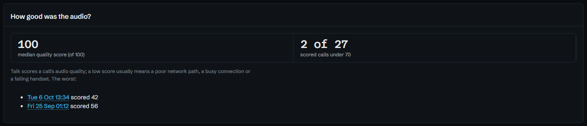
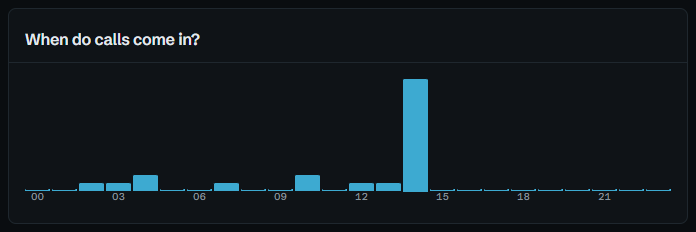
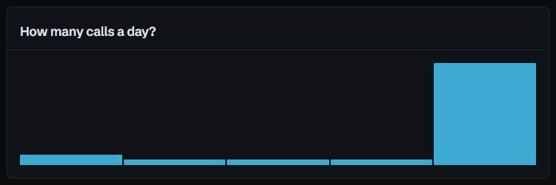

# Analytics and Switchboards

**Analytics** holds the trends: calls by outcome, answer rate, busiest hours,
how fast missed callers were got back to, how long phones ring before someone
answers, when calls go unanswered by weekday and hour, and Talk's call-quality
scores. Everything on it is counted only over the lines you may see, so two
people can open it and rightly get different figures.

## The period

It opens on the last 7 days, with **Last 30 days** and **Last 90 days** beside
it. Any other period goes in the address, as whole days in the site's time
zone, up to 92 at once:

- `/dashboard?days=30`
- `/dashboard?from=2026-09-01&to=2026-09-30`, September

A sentence at the top says it in words, *1 Sep to 30 Sep 2026: 412 inbound
calls, 81% answered, a median of 14 seconds to answer. The busiest hour was
10:00*, which is usually the line someone's after when they open the page.

## The figures

Inbound calls, how many were answered, missed, left as voicemail or hung up at
the switchboard, outbound calls and the average answered call, then **missed
calls got back to**, the **median time to call back**, and how many are **still
to call back**, which links to the list.

The answer rate counts callers who tried to reach someone: answered, missed and
voicemail. A caller who hung up at the switchboard never rang anyone, so
counting them would make the rate a measure of the greeting rather than the
people answering. They're counted on [Switchboards](#switchboards) instead.

## How fast are calls answered?

Three figures: the median ring before an answer, how long the slowest tenth
rang, and the median wait before a missed caller gave up.

The last two together are the useful part. When missed callers give up only a
few seconds after calls are usually answered, the page says so: those callers
were nearly reached, and answering a little sooner, or ringing more phones,
would reach some of them. When they give up well before, it's the greeting or
the queue that's losing them, not the people answering.

## When are calls missed?

Inbound calls by weekday and hour, each cell the calls nobody picked up out of
those that came in. The darker the cell, the larger the share missed or sent to
voicemail.

It's the grid to plan cover by: a dark noon is lunch with nobody minding the
phones, and a dark first hour on Monday is the weekend arriving at once.

## How good was the audio?

Talk scores each call's audio out of 100. The median, how many scored under 70,
and the worst calls, each a link to the call so the recording can be heard.

A low score usually means a poor network path, a busy connection or a failing
handset. Under 70 is where TalkWatch counts a call as poor: it's amber in the
call log, and it's what the **Poor call quality** alert fires on.

## When do calls come in, and how many a day?

Calls by hour of the day, and by day across the period.

## Which lines get them?

Each number, person, switchboard and ring group, with its inbound calls and how
many were answered, missed, left as voicemail or hung up. A call counts on every
line it passed, so the rows add up to more than the total.

To see one line's calls, search for it with **Ctrl+K**: a line in the results
opens the call log narrowed to it.

## Switchboards

**Switchboards** shows each auto-attendant over the last 30 days (or 7, or 90,
with `?days=`): how many callers reached it, how long its greeting runs, how
many hung up during the greeting and how long they lasted, and what the rest
reached: answered, missed or voicemail.

- **The greeting's length** is measured from its audio, so a change made in
  Talk shows here within the hour.
- **Hung up during the greeting** comes with how many of those callers had rung
  before or rang again: people who know the number, not just robocalls.
- **Menu options** lists each option with its calls and what they led to, and a
  row for callers who **chose nothing**.

If most hang-ups happen in the first fifteen seconds, that's the greeting to
shorten. See [Callers who give up at the switchboard](guides/switchboard.md) for
reading it, and the alert that goes with it.

## The same figures elsewhere

- **Reports** carry the figures by email on a schedule, against the period
  before. See [Reports](reports.md).
- **The API**'s `/api/v1/stats` returns them for any whole days, up to 92. See
  [Export and API](api.md).

## Guides that use these figures

- [Seeing a bad day coming](guides/busy-line.md)
- [Callers who give up at the switchboard](guides/switchboard.md)
- [Knowing when the phones themselves go wrong](guides/phone-health.md)
