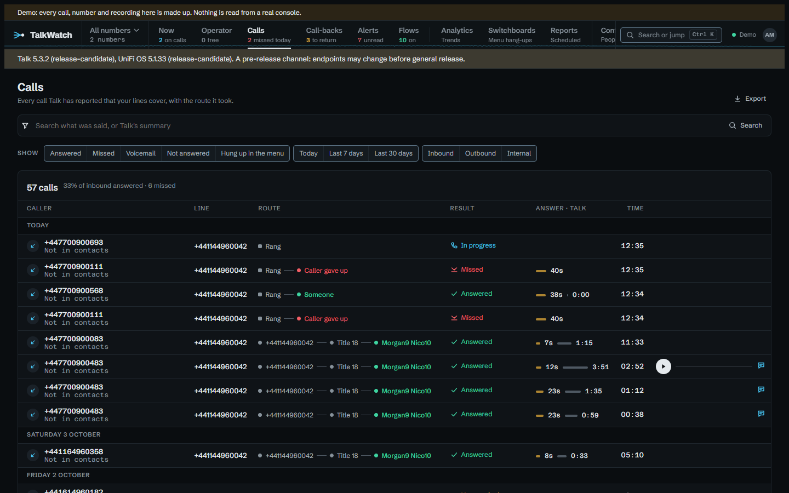
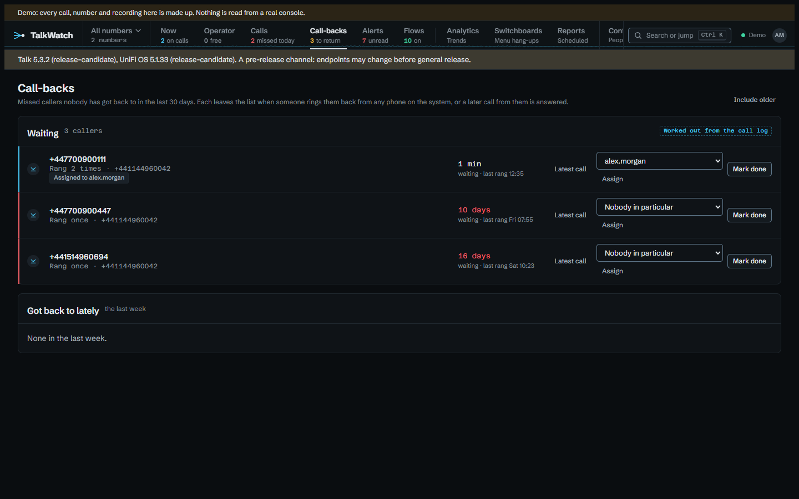

# Calls and call-backs

The call log lists every call you can see, with its outcome worked out from
what happened to it rather than from Talk's status (see the
[home page](index.md) for why). Each filter you add shows as a chip that says
what it does and comes off with one click. The filters live in the address, so
a filtered view can be bookmarked or sent to someone. Someone without the
same access just sees fewer calls.

A call's page tells it as what happened, from Talk's routing events: which
number it came in on, the menu options chosen, who it rang and for how long,
and how it ended. Below that come the recording or voicemail, Talk's summary
and transcript when transcription is on and you're allowed to read it, and
**With this number**, the other calls from the same caller. A forwarded call
that an outside number answered also shows what TalkWatch made of that
number; see [outside voicemail](alerts.md).

**Audio** plays in the page with a waveform. Nothing is downloaded until you
press play, so opening a call doesn't put a play in the audit log. Pressing
play fetches the file once and the waveform is drawn from that same download,
so **one play is one audit entry**. Click a line of the transcript to jump
there; the line being spoken is highlighted. If you move to another page, a
small player keeps the recording going.

A call that's still ringing or sitting in a menu with **nothing new from Talk
for 15 minutes** is treated as over. Talk reports every step of a call while
it's being routed, so that long a silence means its hang-up was never logged,
and without this it would show as live for hours. Any call that started more
than a day ago is taken as finished for the same reason.

## Call-backs

**Call-backs** lists missed callers nobody has got back to in the **last 30
days**, one row per caller however many times they tried. The list is about
people still waiting, and a caller from two months ago is better looked up
than chased; **Include older** shows the lot.

A caller leaves the list when someone rings them back from any phone on the
system, when a later call from them is answered, or when someone marks them
done. The edge of each row turns amber after **4 hours** waiting and red
after **24**.

If your role allows, you can give a caller to one person from the menu on the
row, and the row then shows **Assigned to** them. A flow can do the same
([alerts](alerts.md)). **Got back to lately** underneath shows who was dealt
with in the last week.
