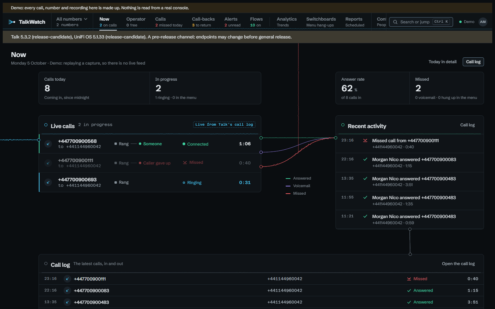

# Trying the demo

You can see TalkWatch working before you point it at a console. Demo mode
replays a capture from a real one that ships in the image: 53 calls, with the
newest moved to an hour ago so the pages have something to show. Every number
in it is fictional and every recording synthetic, and every page says so.



## Starting it

The image has everything the demo needs, so it's the database, the image and
four settings:

```yaml
services:
  db:
    image: postgres:17-alpine
    environment: { POSTGRES_DB: talkwatch, POSTGRES_USER: talkwatch, POSTGRES_PASSWORD: change-me }
  talkwatch:
    image: ghcr.io/thecodesaiyan/talkwatch:latest
    depends_on: [db]
    ports: ["8080:8080"]
    environment:
      ConnectionStrings__TalkWatch: Host=db;Database=talkwatch;Username=talkwatch;Password=change-me
      Demo__Enabled: "true"
      Bootstrap__AdminUsername: admin
      Bootstrap__AdminPassword: a-long-password-of-your-own
```

Then open `http://<host>:8080`.

## What it does

A replay on its own would sit still, so the demo keeps it moving. A new call
arrives every four minutes (`Demo__CallEveryMinutes`), one of each kind in
turn, from missed to answered to hung up in the menu, and calls ring and are
answered on **Now** and **Operator** while you watch, so the example flows have
something to fire on. It starts with example flows, alerts, people holding
roles on the number, and two reports with a copy each to open.

## Trying a scenario

You needn't wait for the next call. A bar at the foot of every page sets a
scenario going, and it plays out in real time on the replayed console, a step
every few seconds, so you can watch it on **Now** or **Operator** as it would
happen on your own phones:

- **Calls**: answered, missed, left as voicemail, or put through to an outside
  phone that answers.
- **Switchboard**: a caller presses 1 and then 2, presses a key that isn't an
  option, or hangs up in the menu. Their card rides through the switchboard on
  **Operator** as they choose.
- **Alerts**: the missed call and the hang-up during the greeting that the
  example flows alert on.
- **People**: someone in the support team goes do-not-disturb, or is on a
  call, for a minute.

Each takes about a minute, and up to four play at once, since everyone trying
the demo shares it. The bar folds down to a tab, and exists only in the demo.

## The guest account

The sign-in page offers a shared **guest** account, with its password on the
page and a **Sign in as guest** button. The guest is an admin, so every page
and button is there to try. What would change the site for whoever comes next
(people, roles, roles on numbers, group mappings, retention, the mail and
Telegram settings) is refused when it's saved, with a message saying why,
rather than hidden.

## What stays in the demo

Nothing leaves the browser. Alerts arrive only in TalkWatch, channels other
than the browser's own can't be added, test sends are refused, and reports are
kept to read but never emailed.

Every 30 minutes (`Demo__ResetMinutes`) the demo starts over: it clears the
calls, alerts, flows, channels and reports it has gathered and sets the
examples up again, and a banner counts down to it. People and roles are kept,
so nobody is signed out.

The names in the capture were pseudonymised along with the numbers. The demo
gives the switchboards, options and ring group readable names ("Main
switchboard", "1 · Sales and billing", "Support team"), and the people are
stand-ins for whoever answers your phones.

When you're ready for your own console, carry on with [Installing](install.md).
