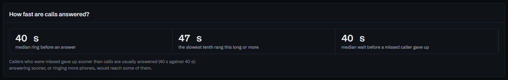
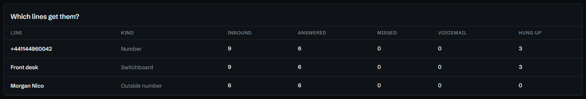

# Seeing a bad day coming

One missed call is a caller to ring back. Six in an hour is a problem with the
day: someone off sick, a ring group with nobody left in it, a queue nobody's
watching. The figures at the end of the month will show it, long after it could
have been fixed. TalkWatch can tell someone while it's happening, and show when
it tends to happen so it can be planned for.

## Hearing about it while it's happening

Four conditions look at the line rather than the caller. Each is tested when an
alert comes in, so a flow on **Missed call** with one of them only goes further
when the day has turned bad:

| Condition | Holds when |
|---|---|
| **If the answer rate drops** | the number's answer rate over the last so many hours, up to a day, is below a percentage. Only once there are three calls to judge by, so one missed call first thing isn't a rate of nothing |
| **If the number keeps missing calls** | N calls in on the same number went unanswered in the last so many minutes |
| **If callers are waiting** | at least N missed callers on the number are still to be rung back, as **Call-backs** counts them |
| **If it rang long** | it rang longer than so many seconds before it was answered, went to voicemail or the caller hung up |

The demo starts with two flows built on them:

```text
Answer rate slipping
When    Missed call
If      the number's answer rate over 2 hours is below 70%
Notify  the manager
```

```text
Call-backs piling up
When    Missed call
Branch  on 3 or more callers on the number are waiting to be called back
  If so       Notify  the manager, urgent
  Otherwise   Notify  whoever it rang
```

The second is worth copying as it stands. On a quiet day each missed call goes to
whoever it rang, as usual. Once three callers are waiting, the same missed call
goes to the manager instead, marked urgent, because by then it isn't one call
any more.

On a busy line, put a **Bundle** step before the notify, so a bad half hour
arrives as one message (*5 × Missed call*) instead of five buzzes, and set
**quiet hours** on the channel so the manager isn't woken by Sunday's calls.

## Seeing when it happens

**Analytics** holds the figures to plan by, over 7, 30 or 90 days, or any
period up to 92 days with `?from=` and `to=` in the address.

**When are calls missed?** is a grid of weekday by hour, darker where a larger
share of calls went unanswered. A dark column at 12:00 is lunch with nobody
covering; a dark Monday morning is the weekend's call-backs arriving at once.


**How fast are calls answered?** sets how long phones ring before an answer
against how long missed callers waited before giving up. When those two are
close, as here, callers are giving up just before someone would have answered,
and the page says so: answering a little sooner, or ringing more phones, would
reach some of them.



**Which lines get them?** breaks the calls down by number, person, switchboard
and ring group, to see which line the missed calls are on.



## The same, in a report

The **Weekly summary** report puts the figures, each line, who answered and the
busiest times in an inbox on Monday morning, each figure against the week
before, green when it moved the right way and red when it didn't. See [A report
in the manager's inbox](reports-for-managers.md).

## Try it in the demo

Play **Missed** from **Try a scenario** a few times. Watch the answer rate on
**Now** fall, then open the *Call-backs piling up* flow and press **Try it on
the last 7 days**.

## See also

- [Conditions](../alerts.md#conditions), the full list.
- [Analytics and Switchboards](../analytics.md).
- [Getting back to every missed caller](missed-callers.md), for one caller at a
  time.
