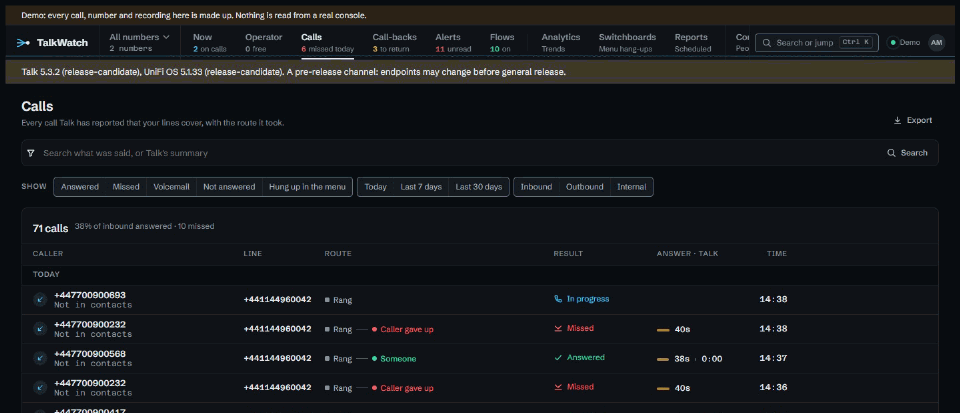

# Finding a call and what was said

"Someone rang on Tuesday about the invoice, and I said I'd call back." Talk's own
call log can find Tuesday. It can't find *the invoice*, and once the console
has pruned the recording there's nothing left to listen to anyway. TalkWatch
keeps its own copy of every call, recording and voicemail, and lets you search
what was said.

## Search what was said

The search box on **Calls** looks through the transcripts and Talk's summaries
of the calls you may read, so *invoice* finds the call where the caller said
it, whichever line it came in on. It needs Talk's AI transcription to be on, and
finds only calls whose transcripts you're allowed: without the transcripts tick
on a line, a search finds nothing in its calls, rather than hinting at what
they said.

`/calls?q=invoice` is the same search as a link.

## Or narrow it down

Every filter is a click, shown as a chip that says what it does and comes off
with another. The filters live in the address, so a view can be bookmarked or
sent to someone; someone without the same access just sees fewer calls.

| Filter | Choices | In the address |
|---|---|---|
| Result | answered, missed, voicemail, not answered, hung up in the menu | `outcome=answered`, `missed`, `voicemail`, `unanswered`, `menu` |
| Date | today, last 7 days, last 30 days | `period=today`, `7d`, `30d` |
| Direction | inbound, outbound, internal | `dir=in`, `out`, `internal` |
| What was said | any words | `q=…` |

The heading counts what's left: *53 calls, 33% of inbound answered, 4 missed*.

## Or jump straight to it

**Ctrl+K** opens the palette, which searches calls, numbers, people and lines as
you type. Three digits or more find a caller's number from any part of it, and
the format doesn't matter: *0752*, *07700 900752* and *+44 7700 900752* find the
same caller, so the last four digits on a sticky note are enough.

## What a call's page tells you

A call's page tells it as what happened, from Talk's routing events: which number
it came in on, the menu options chosen, who it rang and for how long, and how it
ended. Below that come the recording or voicemail, Talk's summary and the
transcript, and **With this number**, the other calls from the same caller, so
"they've rung three times this week" is there without looking.

- **The recording plays in the page**, with a waveform. Nothing's downloaded
  until you press play, and the waveform is drawn from that same download, so
  opening a call isn't a play and one play is one entry in the audit log.
- **Click a line of the transcript** to jump there. The line being spoken is
  highlighted.
- **Move to another page** and a small player keeps the recording going.
- **A caller the call doesn't name** is named from Talk's contacts, here and in
  alerts.

## Why keep a copy at all

Consoles prune old audio, and firmware updates have wiped app data before.
TalkWatch copies recordings and voicemail off the console as they appear, into
its own storage, and keeps them for as long as **Retention** says: everything,
or a preset such as UK GDPR, which removes calls and audio after set periods.
See [Retention](../retention.md) and [Backups](../backup.md).

## Taking it elsewhere

**Export** on **Calls** downloads a date range, up to a year, as CSV for a
spreadsheet or Parquet for DuckDB, pandas or Power BI. Every export goes in the
audit log. See [Using TalkWatch's data elsewhere](integrations.md).

## Try it in the demo

Every recording in the demo is synthetic, and every page says so. Open **Calls**,
choose **Answered**, and open a call with a recording to play it and click
through the transcript.

## See also

- [Calls and call-backs](../calls.md).
- [Data protection and recording](../data-protection.md), on recording calls
  lawfully and who may hear them.
