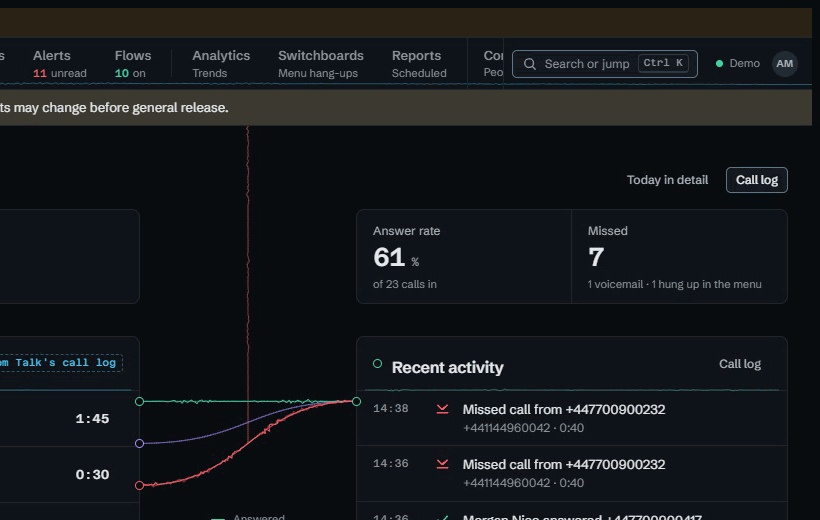
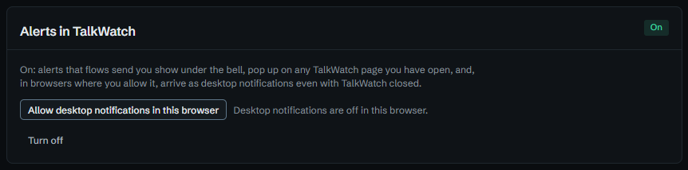

# Running the front desk from one screen

Whoever looks after the phones all day needs to know three things at a glance:
who's ringing that nobody has picked up, who's free to put a call through to,
and who's waiting to be rung back. Talk's own app answers each of those on a
different screen, and none of them live. **Operator** puts all three on one,
and keeps it current as Talk reports each step.

## Where callers are in the switchboard

Each switchboard is drawn as the flow its callers move through: in, the menu,
each option, and where each option puts calls. A caller in the menu is a card at
the stage they last reached, with how long they've been there, and as Talk
reports each key they press, the card moves along to the option they chose.

That matters at a desk because a caller who's been in the menu for two minutes
is a caller about to hang up. Seeing them there is the chance to pick up their
call when it rings through, rather than finding it on the missed list later.

## Who's free

**People** lists everyone by ring group, with their presence, so it's clear
which team has someone free before a call is put through. Choose a number in
the switcher on the rail and only the groups and people a call to that number
can reach are shown. A mobile a group forwards to is listed under **Forwarded
to**, and never counted as free, because Talk knows nothing of whether the
person carrying it is.

**Needs someone** comes first on the page: calls ringing or waiting that nobody
has picked up. **Call-backs waiting** sits on the right, longest first.

TalkWatch reads Talk and never controls it, so answering and transferring stay
on the handset. Operator is for deciding where a call should go, and the
handset is still where it's sent.

## Leave Now open

**Now** is the other screen worth leaving up. It's laid out as calls move: they
stream in to **Live calls**, leave by how they ended into **Recent activity**,
and drop into the call log. A missed call's mark climbs to the rail's *missed
today* as it lands.

A list holds still while the pointer is over it, because a row that moves just
as it's clicked sends the click to its neighbour. The heading counts what's
waiting to come in (*2 waiting · Show*) instead.

## Hearing about it without watching

Nobody watches a screen all day. Turn on **Alerts in TalkWatch** on your
**Account** page and allow desktop notifications, and the alerts a flow sends
you appear as a pop-up on any TalkWatch page that's open, and as a desktop
notification even with TalkWatch closed.

Desktop notifications use Web Push, which browsers allow only over HTTPS, so
they need TalkWatch behind a certificate. See [Behind a reverse
proxy](../proxy.md).

## Getting about quickly

- **Ctrl+K**, or **/**, opens the command palette: type a caller's number, a
  name, or *missed* for today's missed calls.
- **g** then a letter jumps to a workspace: **g o** for Operator, **g n** for
  Now, **g b** for Call-backs.
- Choosing a call on any board opens it beside the page, with its route and
  what happened, so the board stays in view.

## Try it in the demo

From **Try a scenario**, play **Presses 1, then 2** and **Presses a wrong key**
with **Operator** open, and watch the cards move through the menu. **Do not
disturb** and **On a call** change someone's presence in the support team for a
minute.

## See also

- [Operator](../operator.md) and [Now](../now.md) in the tour.
- [Finding your way round](../using.md) for every key.
- [Getting back to every missed caller](missed-callers.md).
