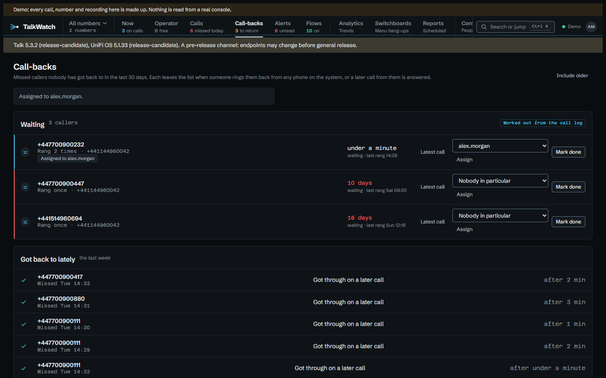
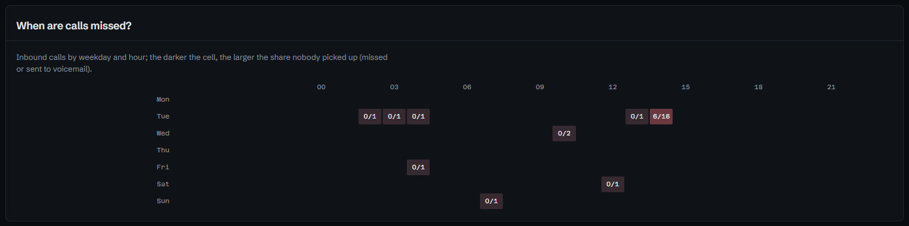
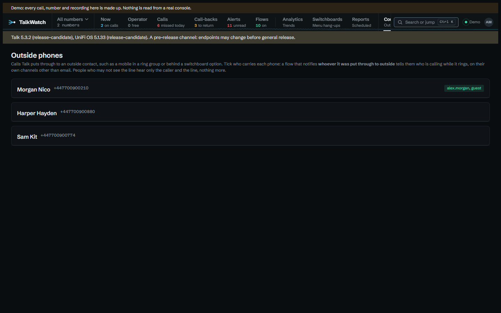
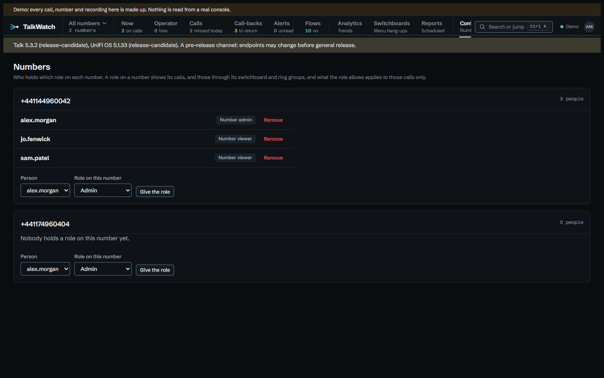
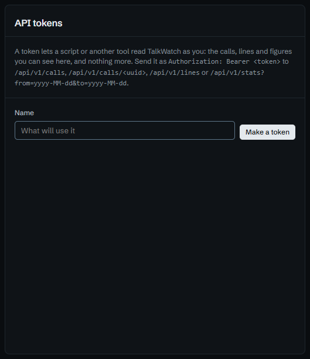

# What it can help with

The tour says what's on each page. These guides start from the other end: a
problem a site with a phone system tends to have, what TalkWatch does about it,
and how to set it up, with the flow or report to copy and a link to try it in
the [demo](../demo.md). Every example here is one the demo starts with or can
play out, so nothing on these pages is a mock-up. The demo's flows notify its
own two accounts; the examples here say who that would be on a real site
instead, *the manager* or *the front desk*.

They're grouped by who usually has the problem, though most sites have one
person who's all three.

## For whoever answers the phones

-   

    **[Getting back to every missed caller](missed-callers.md)**

    A list of who's still waiting, that empties itself as people are rung back,
    and a nudge to the right person when it doesn't.

-   

    **[Running the front desk from one screen](front-desk.md)**

    Who's in the menu, who's free, what's ringing and who's waiting for a call
    back, live, without touching the handsets.

-   

    **[Voicemail that can't wait](voicemail.md)**

    Hear about a message as soon as it's left, with what was said, and sooner
    still when it says *urgent*.

-   

    **[Finding a call and what was said](finding-a-call.md)**

    Search what callers said, play the recording in the page, and see every
    other time that number rang.

## For whoever runs the place

-   

    **[Seeing a bad day coming](busy-line.md)**

    Hear when the answer rate drops or call-backs pile up, rather than finding
    out from the figures at the end of the month.

-   

    **[Callers who give up at the switchboard](switchboard.md)**

    Which greeting people hang up during, how long they last, and which menu
    option leads nowhere.

-   

    **[A report in the manager's inbox](reports-for-managers.md)**

    Monday morning's figures by email, each copy showing only what its reader
    may see.

-   

    **[Calls when you're closed](out-of-hours.md)**

    Send out-of-hours calls to whoever's on call, and keep them out of the
    figures you judge the day by.

## For whoever looks after it

-   

    **[Staff who answer on their mobiles](mobiles.md)**

    Tell a mobile who's calling while it rings, name who answered, and catch the
    calls a mobile's own voicemail took.

-   

    **[Giving someone their own number](one-number.md)**

    The sales line's manager sees the sales line, sets up its alerts and
    reports, and nothing else.

-   

    **[Knowing when the phones themselves go wrong](phone-health.md)**

    A handset dropping off, an account suspended, recording switched off, a
    console update that changed what Talk sends.

-   

    **[Using TalkWatch's data elsewhere](integrations.md)**

    Signed webhooks, a read-only API, and Parquet for DuckDB, pandas or Power BI.

## Links worth bookmarking

Every filter on the call log and every period on Analytics lives in the
address, so a view somebody checks every morning can be a bookmark, or a link
in a message. Each opens with the reader's own access, so sending one to
someone with less shows them less, not an error.

| Link | Shows |
|---|---|
| `/calls?outcome=missed&period=today` | today's missed calls |
| `/calls?outcome=unanswered&period=7d` | this week's calls nobody answered: missed, voicemail and hung up in the menu |
| `/calls?outcome=menu&period=30d` | callers who hung up at the switchboard in the last 30 days |
| `/calls?outcome=voicemail&period=30d` | voicemail from the last 30 days |
| `/calls?dir=out&period=today` | outbound calls today |
| `/calls?q=refund` | calls where the transcript or Talk's summary mentions a refund |
| `/calls?line=Did:%2B441144960042` | calls on one number (the `+` is written `%2B`, since a bare `+` in an address means a space) |
| `/callbacks?all=1` | every caller still to ring back, however long ago they rang |
| `/dashboard?days=30` | Analytics for the last 30 days (7, 30 or 90) |
| `/dashboard?from=2026-09-01&to=2026-09-30` | Analytics for September, up to 92 days at once |
| `/switchboard?days=90` | the switchboards over the last 90 days (it starts on 30) |

The first five are in the command palette too, by name: press **Ctrl+K** and
type *missed*, *nobody*, *menu*, *voicemail* or *outbound*. See [Finding your
way round](../using.md).
