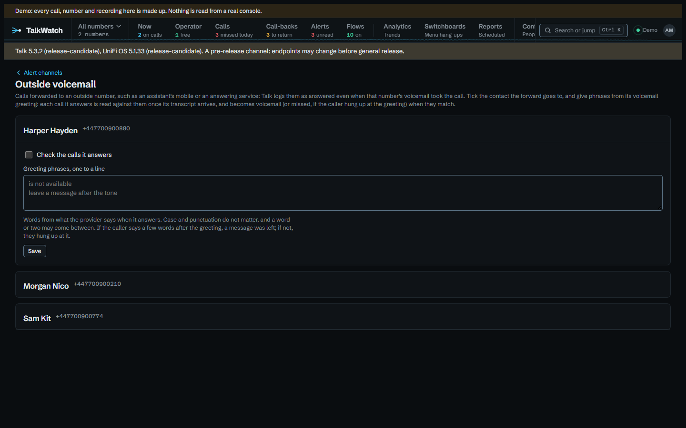

# Staff who answer on their mobiles

Plenty of small sites put calls through to mobiles: a ring group with the
owner's mobile in it, a switchboard option that forwards to the on-call phone, a
group that overflows to an answering service. Talk handles the call well enough.
What it reports afterwards is less helpful:

- it doesn't say **who answered**. The forward goes to a contact's number, and
  Talk records that number, not a person;
- it logs the call as **answered** the moment anything picks up, including the
  mobile's own voicemail, so a caller who left a message on a personal mobile
  counts as answered in every figure and never reaches the call-back list;
- and the person carrying the mobile sees a number they may not know, with a
  few seconds to decide whether to pick up.

TalkWatch has an answer to each. The first needs nothing set up; the other two
are under **Configure**.

## Who answered

Nothing to set up. When Talk's record of a call gives only the number that
picked up, TalkWatch names it from Talk's contacts and directory, so **Now**,
the call log and a report's **Who answered** say *Morgan Nico (mobile)* rather
than a bare number. On the console TalkWatch was built against that was every
answered call: Talk never named a user who answered, because each was answered
by a contact's mobile through a forward, so without this every *who answered*
would be blank.

## Who carries which phone

Say who carries each outside phone under **Configure → Outside phones**, or under
**Carries the outside phone of** on a person's own page. One phone can be carried
by several people, as an on-call mobile passed round the staff is. It's what the
next section's alert uses to find them.


## Telling the mobile who's calling while it rings

The demo starts with a flow called *Put through to a mobile*:

```text
When    Any incoming call
If      put through outside
Notify  whoever it was put through to outside
```

Talk's live feed reports the outside phone being tried while the call's still
going, so the alert reaches whoever carries it while it rings, with the caller's
number and name and the number they rang. A flow with **If put through outside**
starts when the call's put through rather than when it comes in, so it waits for
the forward instead of missing it.

- It never goes by email, which would arrive long after the phone stopped:
  push, ntfy, Telegram and webhooks only, and never bundled.
- Once someone else answers, a desk phone or another mobile, the alert is
  acknowledged and whoever was told hears that someone else answered, so nobody
  rings the caller back for nothing.
- The people it reaches may not be allowed to see that line's calls, so they're
  told the caller's number and name, the number rung and when, and nothing
  more: no summary, no voicemail, no link to the call. Only an admin can build
  it.

**Everyone who carries an outside phone, whatever the call** is there too, for
a team that wants every forwarded call shown on every on-call phone.

## Calls a mobile's voicemail took

Tick the contact under **Configure → Outside voicemail**, and give phrases from
its voicemail greeting, one to a line: *is not available*, *leave a message
after the tone*.



Each call it answers is then read against them once Talk's transcript arrives:

| What the transcript holds | The call becomes |
|---|---|
| no phrase | answered, as Talk said: a person picked up |
| a phrase, then the caller speaking | **Voicemail, outside**: it raises **New voicemail** and goes on the call-back list |
| a phrase, then nothing | **Missed, outside**: the caller hung up at the greeting, and it raises **Missed call** |

Phrases match whatever the case, and the letter *o* and the digit *0* count as
one, because speech-to-text writes a brand however it hears it: "o2 messaging"
matches a transcript's "02 messaging".

What it can't do is check a call with no transcript. Transcription can be on
for some numbers and off for others, and guessing from the length would mislabel
the short calls a person really took, so a call without one stays answered and
its page says it wasn't checked. The page also says what was decided and which
phrase matched, and anyone who may mark call-backs can correct it.
**Reprocess its calls** reads every call the contact has answered again, so a
phrase added today can fix last month's figures too.

## Try it in the demo

Play **Outside phone answers** from **Try a scenario**, and see who answered on
**Now**. The *Put through to a mobile* flow is under **Flows**.

## See also

- [Calls put through to an outside phone](../alerts.md#calls-put-through-to-an-outside-phone)
  and [Calls an outside answering line's voicemail took](../alerts.md#calls-an-outside-answering-lines-voicemail-took),
  for the full rules.
- [Signing in and access](../access.md#lines-and-grants), on why the outside-phone
  alert is the one deliberate exception to access by line.
