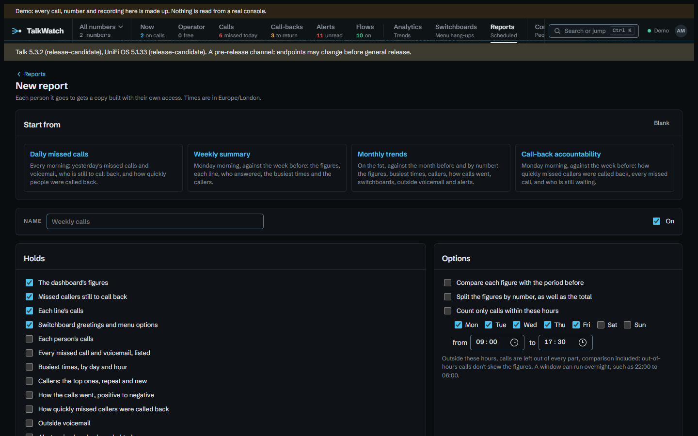
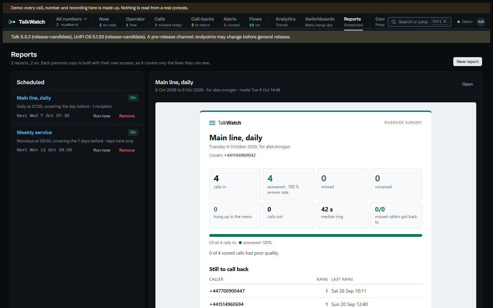

# A report in the manager's inbox

Most people who want the phone figures want them once a week, not a dashboard
to remember to open. A report is the same figures as Analytics, gathered over a
period on a schedule, and emailed. The point of it is the inbox: the line a mail
client shows beside the subject carries the headline figures, so a manager can
see how the week went without opening it.

## Start from a ready-made one

**Reports → New report** offers four to start from, with their parts, schedule
and options filled in and everything still to change before it's saved:

| Start from | Runs | Holds |
|---|---|---|
| **Daily missed calls** | every morning at 08:00, the day before | the missed calls and voicemail, who's still to call back, how quickly people were called back |
| **Weekly summary** | Monday at 08:00, against the week before | the figures, each line, who answered, the busiest times, the callers, who's still to call back |
| **Monthly trends** | the 1st at 08:00, against the month before, by number | the figures, busiest times, callers, how calls went, switchboards, outside voicemail and alerts |
| **Call-back accountability** | Monday at 08:00, against the week before | how quickly missed callers were called back, every missed call, who's still waiting, who answered |

Who it goes to and which numbers it covers are always chosen, never filled in.

A report can also run on a **cron** expression: `0 8 * * 1-5` is 08:00 on
weekdays, covering whichever period is chosen with it, up to 92 days.

## Three options worth knowing

- **Compare each figure with the period before**: under each headline figure,
  its change on the period just before, green when it moved the good way and red
  the bad way. A 62% answer rate means little alone; 62%, down from 78%, is a
  conversation.
- **Split the figures by number**: the headline figures for each number as well
  as the total, for a site where sales and support are separate lines with
  separate managers.
- **Count only calls within these hours**: Monday to Friday 09:00 to 17:30, say.
  Calls outside it are left out of every part, comparison included, so the
  answer rate isn't dragged down by calls nobody was ever going to answer. The
  report says which hours it counts.

## Each reader sees only their own

Each copy is built with its reader's own access, as if they'd looked themselves.
Send one weekly report to the sales manager and the support manager, and each
gets a copy covering their own lines and nothing else. Nobody has to keep two
reports in step.

The copy is emailed to the person's reporting address, or their account email
when it's empty. The reporting address is set on their page and never changed by
single sign-on, so it suits a shared inbox. Every copy is also kept under
**Reports**, as it was when it ran, with its call list to download as CSV.

## Built for mail clients

A report is laid out for the mail clients most copies are read in, not for
browsers: tables for the layout, every style inline, no web fonts and no SVG,
which Gmail drops, so the bars are coloured table cells. Inside TalkWatch a
copy is shown on a light page even in the dark theme, as it looks in the email.

## Try it in the demo

The demo starts with two reports and a copy of each. Open **Reports**, then
**New report**, and pick **Weekly summary** to see what it fills in. Reports in
the demo are kept to read but never emailed.

## See also

- [Reports](../reports.md), every part and rule.
- [Giving someone their own number](one-number.md), for a manager who sets up
  their own number's reports.
