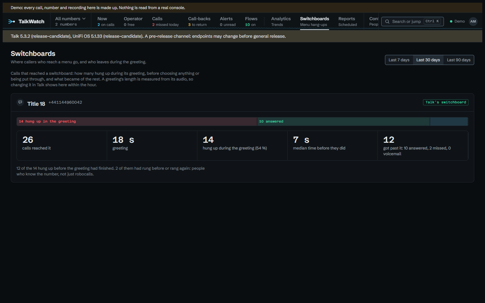
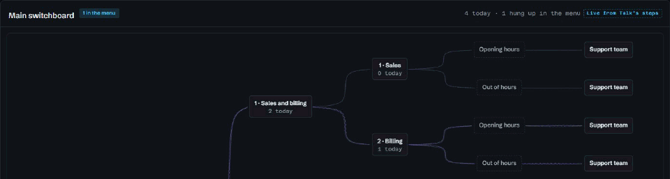

# Callers who give up at the switchboard

A switchboard, Talk's auto-attendant, is the first thing most callers hear, and
it's where a good share of them stop. On the console TalkWatch was built
against, 70 of 155 inbound calls ended at the switchboard, after about 14
seconds on average. Some of those are robocalls and wrong numbers, which is
fine. Some are customers who didn't want to sit through the greeting, which
isn't, and Talk's own log counts them all as `accepted`, so there's no way to
tell from it which you've got.

## Where they hang up

**Switchboards** shows each one over the last 30 days (or 7, or 90): how many
calls reached it, how long its greeting runs, how many hung up during the
greeting and how long they lasted, and what became of everyone who got past it.



Read it like this:

- **Most hang-ups in the first fifteen seconds, with a 40-second greeting**:
  callers aren't waiting for it to finish. That's the greeting to shorten, or
  the option most people want to move to the front.
- **Hang-ups that come back**: the page counts how many of the callers who hung
  up had rung before or rang again. Those are people who know the number, not
  robocalls, and they're the ones the greeting is losing.
- **A menu option with a high hung-up or missed count**: the option leads
  somewhere that doesn't answer. Look at which ring group it rings, and when.
- **Chose nothing**: callers who listened to the menu and pressed nothing. If
  that's large, the options probably don't say what callers came for.

A greeting's length is measured from its audio, so a shorter greeting saved in
Talk shows here within the hour, and the next month's figures say whether it
helped.

## Watching it happen

**Operator** draws each switchboard as the flow callers move through, with each
caller as a card at the stage they've reached, moving as they press keys.



## Hearing about the ones that matter

**Hung up at the switchboard** is its own trigger, kept apart from **Missed
call** because most of these aren't missed calls. The demo's *Hung up in the
menu* flow uses a branch to tell the two kinds apart:

```text
When    Hung up at the switchboard
Branch  on the caller is someone known
  If so       Notify  the front desk, urgent
  Otherwise   Notify  the front desk
```

**If known caller** holds when the caller is named on the call or is one of
Talk's contacts, so a regular customer hanging up in the menu is urgent and a
number nobody knows isn't. Add **If repeat caller** for anyone who's tried
twice in the hour, or leave the otherwise path empty to hear only about people
you know.

**If they chose** narrows a flow to callers who picked particular options, so
the sales team can hear about missed calls that came through *1 · Sales and
billing* without hearing about support's.

## Lists to send round

- `/calls?outcome=menu&period=30d` is every caller who hung up at a switchboard
  in the last 30 days, with the route each took.
- A report with **Switchboard greetings and menu options** carries the same
  figures as the page, by email. The **Monthly trends** report starts with it
  ticked.

## Try it in the demo

Play **Hangs up in the menu** and **Hang-up alert** from **Try a scenario**,
with **Operator** open, then look at **Switchboards** and the *Hung up in the
menu* flow.

## See also

- [Analytics and Switchboards](../analytics.md#switchboards).
- [Running the front desk from one screen](front-desk.md).
