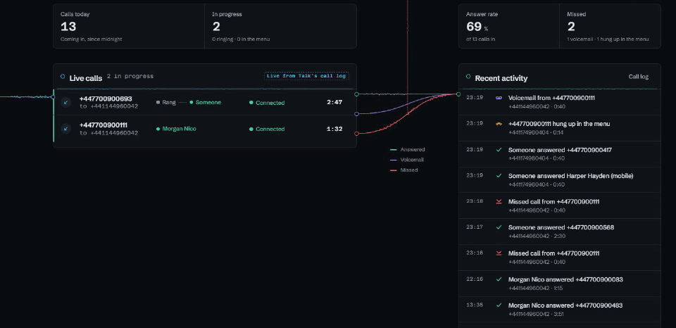
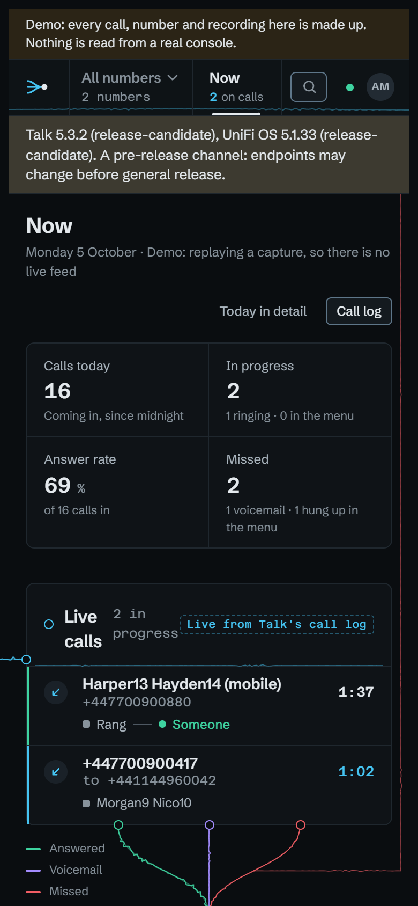
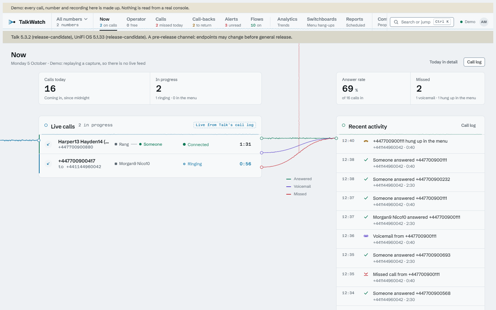

# Now

TalkWatch opens on **Now**: what the phone system is doing at this moment.
It's laid out as the calls move through it. Calls stream in to **Live calls**,
from ringing through to connected. When one ends it stays a few seconds,
faded, with how it ended, then travels along its stream (answered, voicemail
or missed) into **Recent activity**, and from there into the **call log** at
the bottom. A missed call's mark also climbs to the rail's "missed today",
which changes when it lands. The streams get busier the more calls took that
path in the last five minutes. Above the lists are today's calls, calls in
progress, the answer rate and missed calls; below them, who's on a call and
which handsets are online. The page stays live, so you can leave it open.

When a call comes in, a pulse runs in from the left along the inlet, and its
row appears as the pulse lands, with **Calls today** and **In progress**
changing at the same moment. A count is never held back longer than the move
that explains it: about half a second for an arrival, a second and a quarter
for a missed call's mark on its way to the rail.

A list holds still while your pointer is over it, or you're tabbing through
it, because a row that shifts just as you click lands the click on its
neighbour. Its heading counts what's waiting
("2 waiting · Show"); choose that to catch up at once, or move away and it
catches up half a second later. The figures above never wait. If your system
is set to reduce motion, nothing travels: changes just appear where they land.

Below 1000px of room, on a narrow window or with a call open beside it, the
board stacks into one column and the streams run down between the lists. In
the light theme it's the same board on paper.

{ width="260" }
{ width="440" }

The people and handsets come from Talk's live feed. If that's down, the
heading says so and what went wrong, and calls carry on being copied from the
call log each poll.
