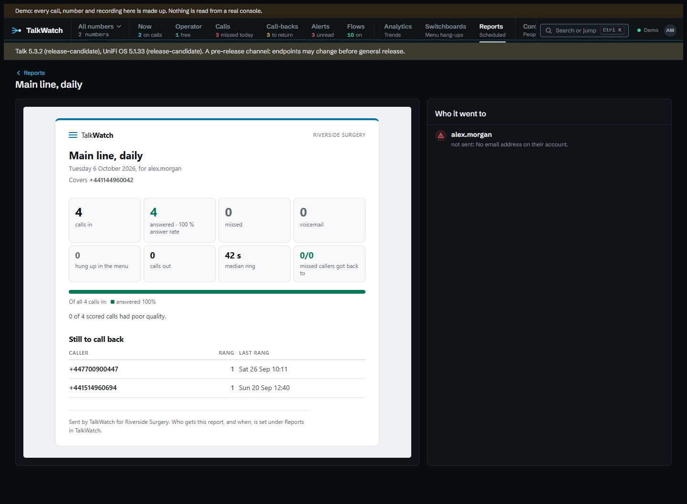

# Reports

A report gathers what happened over a period into one page, on a schedule, for the people it's for. Reports are set up under **Reports** by anyone whose role can *set up reports*, site-wide or on a number (see [Reports on a number](#reports-on-a-number)); anyone can read the copies made for them.

## What a report holds

Any mix of:

- **The dashboard's figures** — calls by outcome, answer rate, how fast calls were answered and how long missed callers waited, missed calls got back to, poor-quality calls, and the busiest times nobody picked up.
- **Missed callers still to call back** — the call-back list as it stands when the report runs.
- **Each line's calls** — answered, missed, voicemail and hung up, per number, person, switchboard and ring group.
- **Switchboard greetings and menu options** — how many hung up during each greeting, and what each menu option led to.
- **Who answered** — each person on the phone system, or outside number a call was forwarded to, with the calls they answered, their average talk time, the median time to pick up, the calls they made and the voicemail left for them. Talk names who answered, not everyone a call rang, so missed calls aren't counted against anyone.
- **Every missed call and voicemail** — listed with when, the caller, the number they rang, how long they waited and whether they've been got back to; the first 200, the call list having them all.
- **Busiest times** — a grid of the week by hour, shaded by calls in, with the calls nobody took in red.
- **Callers** — how many callers there were, how many rang more than once and how many were new to the line, and the top callers with how often they got through.
- **How the calls went** — Talk's transcription's rating of each call, positive to negative, as shares, with the calls rated negative. A reader not allowed transcripts is shown none.
- **How quickly missed callers were called back** — how many were got back to, the median time it took, the share within an hour, how many are still waiting, how, and the slowest.
- **Outside voicemail** — per outside answering line, the messages left with its voicemail and the callers who hung up at its greeting.
- **Alerts** — how many were raised and acknowledged, the median time to acknowledge, by kind and by who.
- **Every call** — the period's calls as a CSV file, the same columns as the export.

## When it runs

- **Daily** at a time, covering the day before.
- **Weekly** on a day at a time, covering the seven days before.
- **Monthly** on the 1st at a time, covering the month before.
- **Cron** — a five-field expression (minute, hour, day of the month, month, day of the week), such as `0 8 * * 1-5` for 08:00 on weekdays, covering the day, the seven days, the month or a number of days (up to 92) before.

Times are in the site's time zone (`Site__TimeZone`) and follow the clocks changing. A period is whole days, ending at the start of the day the report runs. **Run now** makes the report straight away, for the same period. A report due while TalkWatch was stopped runs once when it starts again, not once for every time it missed.

## Who it's for

A new report can start blank or from a ready-made one, with its parts, schedule and options filled in, everything still to change before it's saved:

- **Daily missed calls**: every morning at 08:00, the day before's missed calls and voicemail, who is still to call back, and how quickly people were called back.
- **Weekly summary**: Monday at 08:00, against the week before: the figures, each line, who answered, the busiest times, the callers, and who is still to call back.
- **Monthly trends**: on the 1st at 08:00, against the month before and by number: the figures, busiest times, callers, how calls went, switchboards, outside voicemail and alerts.
- **Call-back accountability**: Monday at 08:00, against the week before: how quickly missed callers were called back, every missed call, who is still waiting, and who answered.

Who a report goes to and which numbers it covers are always chosen.

Each report has three options:

- **Compare each figure with the period before**: under every headline figure, its change on the period just before (this week on last), green when it moved the good way and red the bad way.
- **Split the figures by number**: the headline figures for each number the report covers, or every number, as well as the total. A call that went through more than one number counts under each.
- **Count only calls within these hours**: days of the week and a time window, such as Monday to Friday 09:00 to 17:30, or overnight from 22:00 to 06:00. Calls outside it are left out of every part, comparison included, so out-of-hours calls don't skew the figures. The report says which hours it counts.

A report goes to people, email channels, or both. Each copy is built with its reader's own access, as if they'd looked themselves: a Viewer's report covers only the lines they're granted, and their call list only those calls. A copy for an email channel is built with its owner's access, or the whole site's for a site channel, so only someone who sees every call can send a report to one. With nobody chosen, a report run by hand is built for whoever ran it, with their access, and a scheduled one keeps one copy of the whole site.

Each copy is emailed to its recipients: a person at their reporting address, or their account email when it's empty, and a channel at its address. The reporting address is set on the person's page; single sign-on never changes it, so it suits a shared inbox, or a work address when the sign-in gives a personal one. A copy waiting for another try goes to the address as it is then, so a correction counts at once. The report itself is the email, with a line of plain text for mail clients that show no HTML, and the call list attached as CSV. It goes through the mail server alerts use (set under **Configure → Alert channels**, or `Smtp__` settings). A failure is tried again after 5 and 15 minutes, then 1 and 6 hours, and given up after five tries; someone with neither a reporting address nor an email isn't sent one. A copy's page lists each recipient with where their copy stands: *emailed*, *waiting to send*, *tried 2 of 5 times; tries again at 23:20* with the last error, or *not sent* with the reason it was given up. The error is the mail server's own, so it's usually the quickest way to see what's wrong.

Every copy is kept under **Reports**, as it was when it ran, with its call list to download. Someone reads only their own copies; someone who manages reports, and sees every call, reads them all. Setting reports up isn't a way to see more calls than one's own access shows. Copies go with the report when it's removed, and the [retention](retention.md) sweep removes a copy once every call it covers has gone, since it holds callers' numbers and, with **Every call**, the period's whole call list. The report itself stays.

## How a report looks

A report is laid out in TalkWatch's own look, headed with the site's name (`Site__Name`). Its headline figures are tiles, with a bar showing how the period's calls ended. A report covering some numbers says which under its title. When `Site__PublicUrl` is set, an **Open in TalkWatch** button links to the copy; without it there's nowhere to link to, so there's no button.

It's built for mail clients rather than browsers, because that's where most copies are read: tables for the layout, every style inline, no web fonts and no SVG, which Gmail drops, so the mark and the bars are coloured table cells. The line a mail client shows beside the subject carries the headline figures, so the inbox alone says how the period went. Inside TalkWatch a copy is shown on a light page even in the dark theme, as it looks in the email. A copy made before a change to the layout keeps the layout it was made with.

## Reports on a number

*Set up reports* can be held on a number rather than site-wide, through a role on that number (see [Signing in and access](access.md)). Someone holding it that way:

- sets up reports covering only the numbers they hold it on, and has to choose at least one;
- sees and changes only reports that cover nothing but those numbers, so a report covering a number of someone else's stays out of their hands;
- sends to people and to their own email channels, not to channels someone else set up, since a channel's address isn't theirs to send to.

The editor shows, beside each person, the numbers they hold a role on, so it's clear who a number's report is for. Each copy is still built with its reader's own access, so choosing a person doesn't show them more than they could see anyway.

## Guides

- [A report in the manager's inbox](guides/reports-for-managers.md)
- [Calls when you're closed](guides/out-of-hours.md), for counting only opening hours
