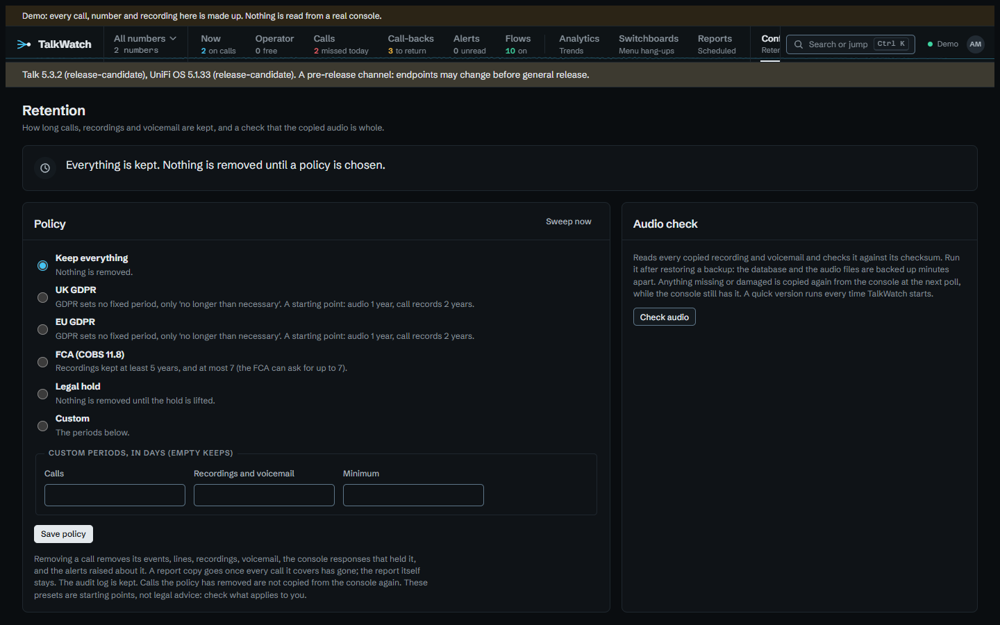

# Retention

An admin sets how long calls and audio are kept, under **Retention**. The default keeps everything, so installing TalkWatch never deletes anything until someone chooses a policy.

| Policy | Calls | Recordings and voicemail | Minimum |
|---|---|---|---|
| Keep everything | kept | kept | none |
| UK GDPR, EU GDPR | 2 years | 1 year | none |
| FCA (COBS 11.8) | 7 years | 7 years | 5 years |
| Legal hold | nothing removed | nothing removed | — |
| Custom | your choice | your choice | your choice |

!!! warning "Not legal advice"
    GDPR sets no fixed period, only that personal data is kept no longer than necessary, so the GDPR presets are
    starting points to adjust, not answers. The FCA preset follows COBS 11.8's five-year minimum and seven-year
    maximum for recorded communications. Check what applies to you.

A **minimum** blocks removal: no period can be set shorter than it, and the page says why when you try. Audio can't be kept longer than its call, since it goes with the call. Transcripts keep to the audio's period: they're what was said, as the recordings are. A **legal hold** removes nothing, whatever periods are set, until it's lifted.

## The sweep

Every six hours, and when you press **Sweep now**, TalkWatch removes what the policy says has been kept long enough:

1. expired recordings and voicemail, from disk first, so no file outlives the record of it;
2. expired calls, with their events, lines and audio records;
3. the console responses that held those calls, and the alerts raised about them, since both carry callers' numbers;
4. report copies whose whole period is older than the calls being kept, for the same reason. A copy that still covers a kept call stays until its last day passes, and the report itself is never removed.

The audit log is kept. The page shows how much the last sweep removed.

The console keeps its own call history, so TalkWatch also refuses to store any call older than the policy keeps. Without that, the next poll could copy back what the sweep just removed.
