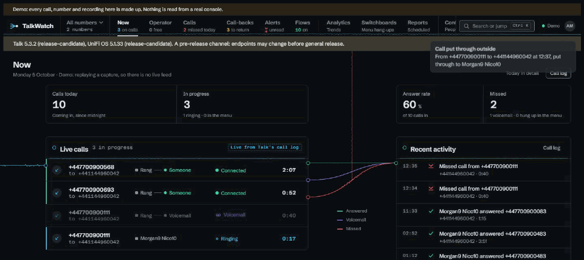
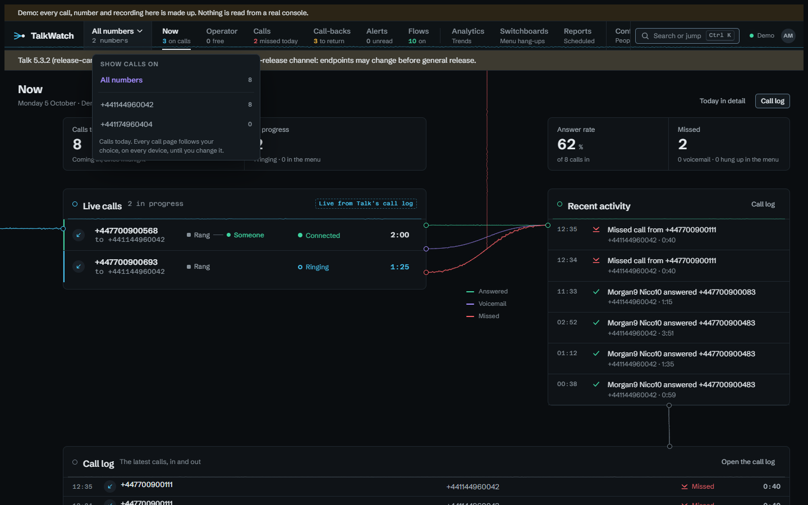

# Finding your way round

TalkWatch has no sidebar. Along the top runs the rail: one word per workspace
with its live count underneath, so the way to a page is also the reason to go
there. "3 missed today" under **Calls** tells you something before you click.
Everything on every page goes through your own access, so the counts are
yours, not the whole site's.

| Workspace | Under the word | Key |
|---|---|---|
| **Now** | calls in progress | `g` `n` |
| **Operator** | people free | `g` `o` |
| **Calls** | missed today | `g` `c` |
| **Call-backs** | callers to return | `g` `b` |
| **Alerts** | unread alerts | `g` `l` |
| **Flows** | flows switched on | `g` `f` |
| **Analytics** | | `g` `a` |
| **Switchboards** | | `g` `s` |
| **Reports** | | `g` `r` |

**Flows** only shows for people who can set up alerts. **Configure** is a menu
at the end of the rail holding People, Roles, Groups, Numbers, Alert channels,
Outside voicemail, Outside phones and Retention, and it lists only the ones
your role lets you open, so the rail stays the same whoever's looking. Settings
live there rather than on the rail because you visit them once and then leave
them alone.

## Getting about by keyboard

- **Ctrl+K** (or **Cmd+K**), or **/** anywhere outside a text box, opens the
  command palette. It goes to anything the rail offers you, runs a few common
  views by name ("Show missed calls today", "Show callers who hung up in the
  menu"), switches between light and dark, and searches calls, numbers, people
  and lines as you type. Searches run through your access, so it never turns
  up a call you couldn't open.
- **g** then a letter jumps straight to a workspace, using the keys in the
  table. You have just over a second after the **g**, and neither works while
  you're typing in a box.

## Looking at one number

When you can see more than one of the site's numbers, a switcher sits next to
the TalkWatch mark on the rail. Pick a number and every call page narrows to
calls on it: the call log, Now, Operator, Call-backs, Analytics and the rest.
It's done in the same place as access itself, so no page can forget to apply
it. The choice is kept on your account rather than in the browser, so it
follows you to your phone, and the switcher changes colour while it's
narrowed so you don't forget either.

## Looking at one call without leaving the page

Choosing a call on Now or in the call log opens it in a panel on the right,
with the page still there beside it. The panel shows how the call ended (or
how it's going), its line, how long it lasted and how long it took to answer,
the route it took and what happened step by step. **Open** goes to the call's
full page, with its recording and transcript. **Pin** keeps the panel open
while you move between pages; otherwise it closes when you go somewhere else.
**Esc** or the cross closes it. On a narrower screen it sits over the page
instead of beside it. To open a call's full page straight away, open the link
in a new tab as you normally would.

## The status strip

When something needs attention, a strip appears under the rail on every page:

- **Talk's data has changed shape.** A console update changed what Talk
  sends, and TalkWatch has stopped copying new calls rather than store them
  wrong. It says when the console was updated and from which versions to
  which. Nothing's lost; see [Upgrading](upgrading.md).
- **The console couldn't be reached** at the last poll, and what you see is
  from the time it says.
- **An untested Talk or UniFi OS version**, or a pre-release channel, where
  endpoints can still change.

When all's well there's no strip. The freshness dot on the rail says so instead.
